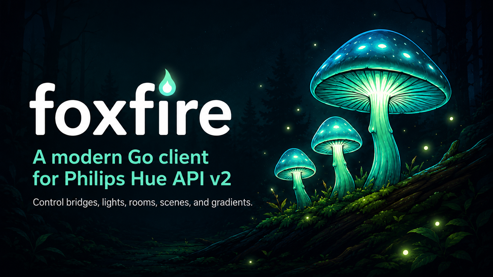

# foxfire



[](https://github.com/scttfrdmn/foxfire/actions/workflows/ci.yml)
[](https://pkg.go.dev/github.com/scttfrdmn/foxfire)
[](https://github.com/scttfrdmn/foxfire/releases)
[](go.mod)
[](LICENSE)

A modern Go client for the Philips Hue CLIP API v2.

Foxfire is the bioluminescence of certain fungi growing in decaying wood — light produced without heat, discovered by anyone who has walked through a damp forest at night. It seemed like the right name for a lighting library.

```
go get github.com/scttfrdmn/foxfire
```

## Why

The existing Go options target the v1 API, which is deprecated, feature-frozen, and cannot address gradient segments. The v2 resource model is a genuine improvement — uniform envelopes, typed references, a real event stream — and deserves a client that reflects it rather than one that papers over v1.

## Quick start

```go
bridges, err := foxfire.Discover(ctx, 5*time.Second)
if err != nil {
    log.Fatal(err)
}
b := bridges[0]

// One-time: press the link button, then
creds, err := foxfire.PairWait(ctx, b.Addr, "myapp", hostname,
    foxfire.WithBridgeID(b.ID))

// Thereafter
c, err := foxfire.New(b.Addr, creds.ApplicationKey,
    foxfire.WithBridgeID(b.ID))

lights, err := c.Lights.List(ctx)
for _, l := range lights {
    fmt.Println(l.Name(), l.On.On)
}

c.Lights.SetBrightness(ctx, lights[0].ID, 40, 1000) // fade over 1s
```

## Design decisions

**Every update field is a pointer.** The bridge applies partial PUTs. A field that is present is a command; a field that is absent means "leave it alone". Without pointers there is no way to distinguish "set brightness to zero" from "don't touch brightness", and the zero value of an update struct silently becomes a command to turn everything off. `Bool`, `Float`, and `Int` helpers keep this from being painful.

**Rate limits are enforced in the client.** The bridge is a small ARM device that silently drops commands past roughly 10/s for individual lights and 1/s for grouped lights. Silently — not with an error. Separate token buckets for each mean callers do not have to rediscover this empirically at 2am.

**TLS posture must be stated explicitly.** The bridge certificate is self-signed with the bridge ID as its Common Name and no SAN matching the IP you dial, so stock verification can never succeed. `New` refuses to construct a client unless you have chosen one of `WithBridgeID`, `WithRootCA`, `WithPinnedFingerprint`, or explicitly `WithInsecureTLS`. The intended path is trust-on-first-use: call `PeerFingerprint` once during pairing on a network you trust, store the result, pin it forever after.

**The event stream is the point.** Polling a bridge is rude and slow. `Subscribe` returns a channel of batches and handles reconnection internally with jittered exponential backoff — the jitter matters, because a household with several subscribers coming back after a bridge reboot should not synchronize into a thundering herd against a single-core CPU.

**State reconciliation is a separate package.** Events carry deltas, not snapshots. A motion-triggered script wants edges and should not carry a cache it never reads; a dashboard wants levels and should not have to write the fold itself. `foxfire/state` does the fold, seeded from a full read, and the one invariant it exists to protect is tested: an event that omits brightness must not clobber brightness.

**Generics carry the transport.** One `getMany[T]`, one `getOne[T]`, one `put`. The typed services on top are thin. There is no code generation and no reflection.

## Scope

In: lights, grouped lights, rooms, zones, scenes, devices, motion and temperature sensors, the event stream, discovery, pairing.

Out, deliberately: the Entertainment API. It is DTLS-PSK over UDP at 50Hz — a different transport with different failure modes and a different testing story. If it lands, it lands as `foxfire/entertainment`, separately versioned.

## CLI

```
foxfire discover
foxfire pair
foxfire lights
foxfire on "Living Room"
foxfire watch
```

Credentials live under your OS config directory, mode 0600 — the application key is a bearer token for every light in the house. That is `~/.config/foxfire/credentials.json` on Linux, `~/Library/Application Support/foxfire/credentials.json` on macOS, and `%AppData%\foxfire\credentials.json` on Windows (Go's `os.UserConfigDir`).

## Status

Pre-1.0. The resource types will grow; the transport and the update semantics are settled.

## License

Apache 2.0.
